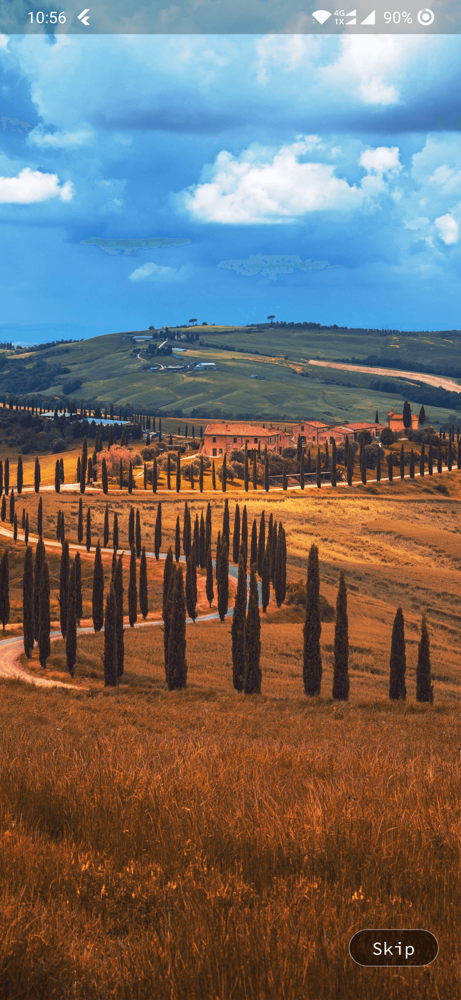
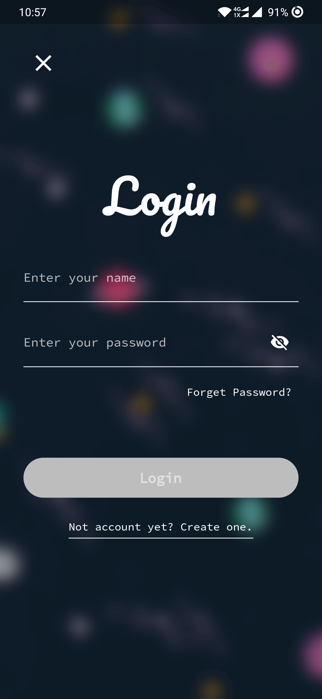
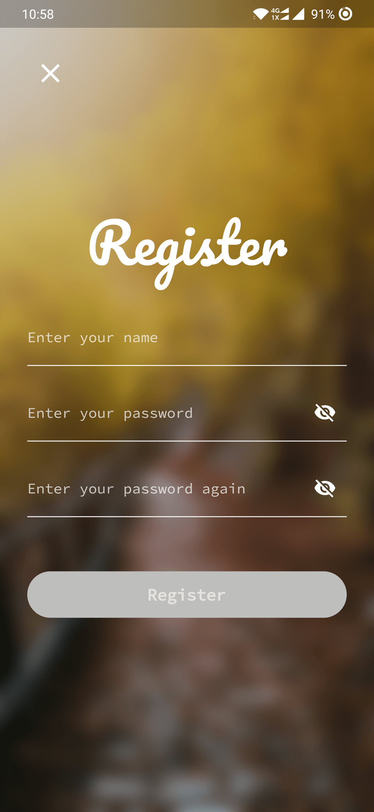
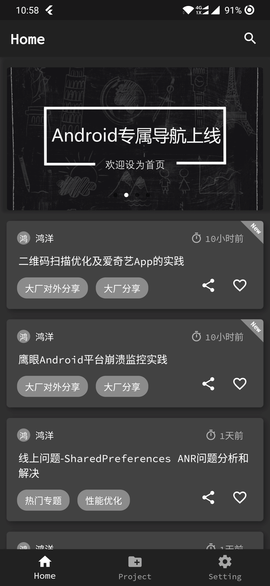
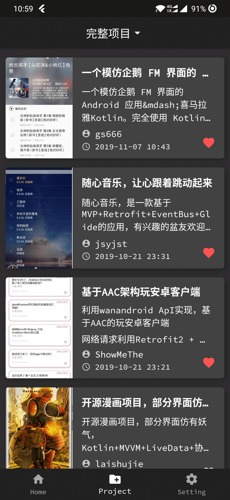
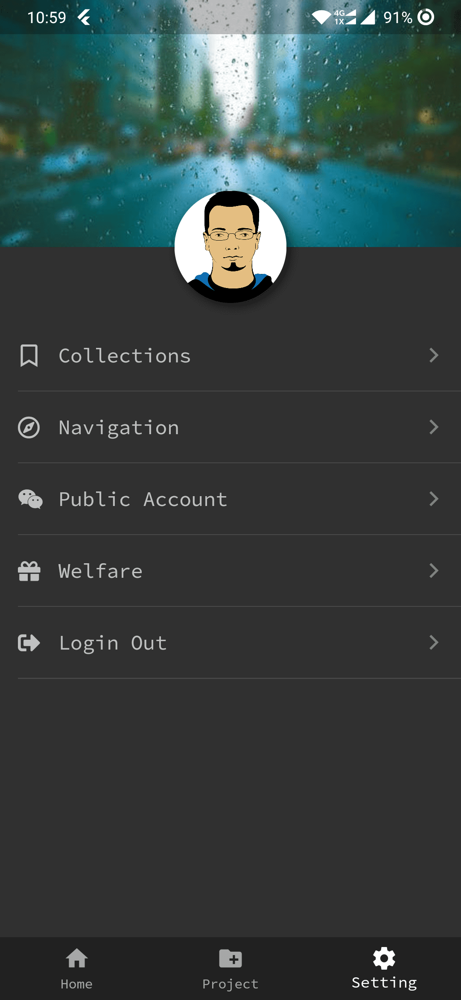
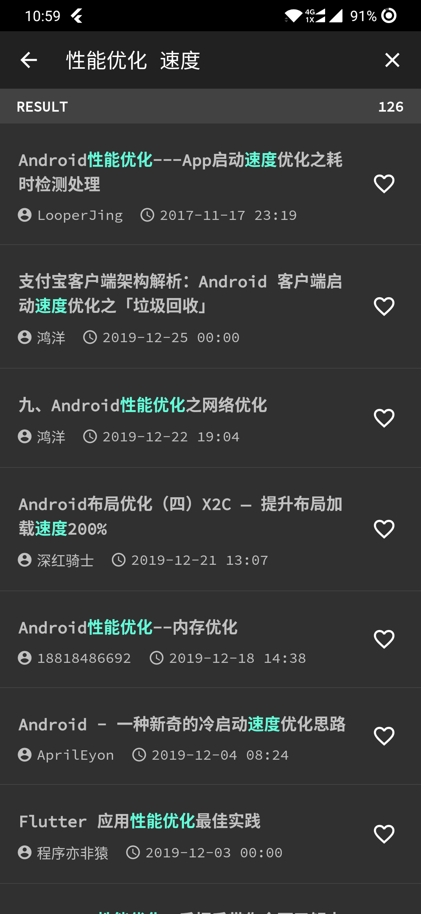

# 玩安卓客户端Flutter版
## 项目概述
本项的数据使用的是鸿洋大神的[玩Android开放API](http://wanandroid.com/blog/show/2)。项目整体使用的是Flutter编写，采用的是[Redux](https://pub.dev/packages/flutter_redux)架构。整体界面使用的[Google Material Design](https://material.io/design/)设计风格。该项目也是自己业余时间学习所写，肯定会有各种不足，如果大家好的意见或建议，欢迎大家提[issue](https://github.com/songmao123/flutter_wanandroid_redux/issues)或[Pull requests](https://github.com/songmao123/flutter_wanandroid_redux/pulls)。

## 项目所使用到的开源库
1. [flutter_redux](https://pub.dev/packages/flutter_redux)
2. [dio](https://pub.dev/packages/dio)
3. [webview_flutter](https://pub.dev/packages/webview_flutter)
4. [esys_flutter_share](https://pub.dev/packages/esys_flutter_share)
5. [cookie_jar](https://pub.dev/packages/cookie_jar)
6. [dio_cookie_manager](https://pub.dev/packages/dio_cookie_manager)
7. [shared_preferences](https://pub.dev/packages/shared_preferences)
8. [flutter_html](https://pub.dev/packages/flutter_html)
9. [photo_view](https://pub.dev/packages/photo_view)
...

## 项目参考
1. [inKino](https://github.com/roughike/inKino)
2. [flutter_architecture_samples](https://github.com/brianegan/flutter_architecture_samples) ...

## 界面预览
     
     
     
